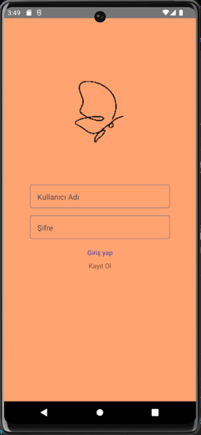
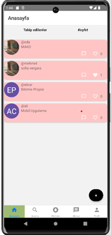
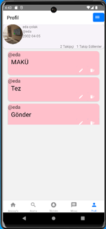

# NoSQL Sosyal Medya Uygulaması

## Proje Tanımı

Bu proje, React Native kullanılarak geliştirilmiş bir sosyal medya uygulamasıdır. Backend tarafı Node.js ile yazılmıştır ve veritabanı olarak NoSQL (Neo4j) kullanılmaktadır. Kullanıcılar kayıt olabilir, giriş yapabilir, gönderi paylaşabilir, diğer kullanıcıları takip edebilir, mesajlaşabilir ve bildirim alabilirler.

## Özellikler

- Kullanıcı kaydı ve girişi
- Gönderi oluşturma ve görüntüleme
- Takip etme ve takipçi listesi
- Mesajlaşma sistemi
- Bildirimler
- Profil görüntüleme ve güncelleme
- Keşfet ve takip edilenler akışı

## Kurulum

1. **Depoyu klonlayın:**
   ```bash
   git clone https://github.com/kullaniciadi/Social-Media-App-with-NoSQL.git
   cd Social-Media-App-with-NoSQL
   ```
2. **Bağımlılıkları yükleyin:**
   ```bash
   npm install
   # veya
   yarn install
   ```
3. **Android veya iOS için çalıştırın:**
   ```bash
   npm run android
   # veya
   npm run ios
   ```

> Not: Uygulamanın backend servisi Node.js ile yazılmıştır ve ayrı olarak çalıştırılmalıdır. API adresleri kodda `http://10.0.2.2:3000` olarak tanımlıdır. Gerekirse kendi backend adresinize göre güncelleyin. Backend tarafında Node.js kullanılmaktadır, bağlantı ayarlarını backend projesinde yapılandırmayı unutmayın.

## Kullanılan Teknolojiler

- React Native (Mobil uygulama)
- Node.js (Backend)
- Neo4j (NoSQL veritabanı)
- Redux & Redux Toolkit
- React Navigation
- Axios
- React Native Paper, RNEUI

## Klasör Yapısı

```
├── src
│   ├── components         # Tekrar kullanılabilir bileşenler
│   ├── pages              # Uygulama sayfaları (login, register, profil, anasayfa, vs.)
│   ├── redux              # State yönetimi
│   ├── assets             # Görseller ve medya
│   └── Router.js          # Navigasyon ve yönlendirme
├── android/ios            # Platforma özel dosyalar
├── package.json           # Proje bağımlılıkları
```

## Arayüzler

- Giriş Ekranı



- Anasayfa



- Profil Ekranı



## Notlar ve Açıklamalar

Bu proje, üniversite bitirme projesi olarak geliştirilmiştir. Uygulamanın hem frontend hem de backend tarafında eksikler ve hatalar bulunabilir. Kodun bazı bölümleri iyileştirilmeye ve geliştirmeye açıktır. Proje, öğrenme ve kendimi geliştirme amacıyla hazırlanmıştır. Geri bildirimlere ve katkılara her zaman açığım.

## Backend

Uygulama için kullandığım backend projesi [SocialMediaAppBackend](https://github.com/edacolakx/SocialMediaAppBackend) adresinde bulunmaktadır.
